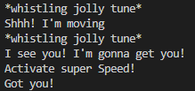

# Finite State Machine and A* Pathfinding
A Pygame application showcasing a finite state machine and A* Pathfinding for the creation of a simple enemy AI.

## Screenshots
The showcase is rather simple, with a red square indicating an enemy patrolling accross the map, 
while a blue rectangle indicating the player can be moved by right clicking somewhere on the black ground.
The light gray rectangles indicate "walls" which cannot be passed, and the move is executed with that in mind.

If the game is run using the main.py file in an editor or through console commands, the following
are potential outputs in the console depending on what the enemy is doing.

